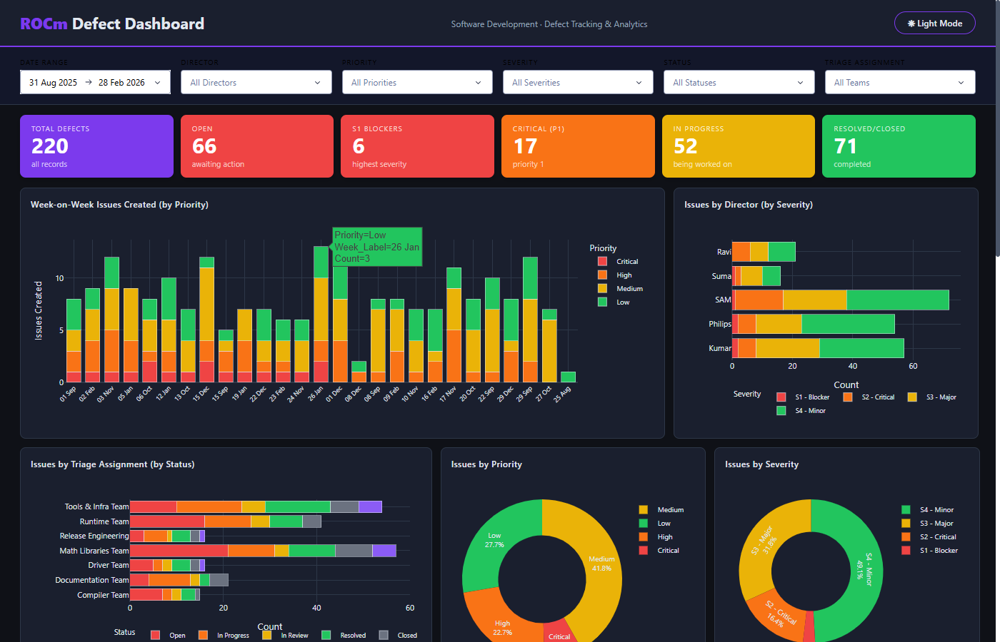
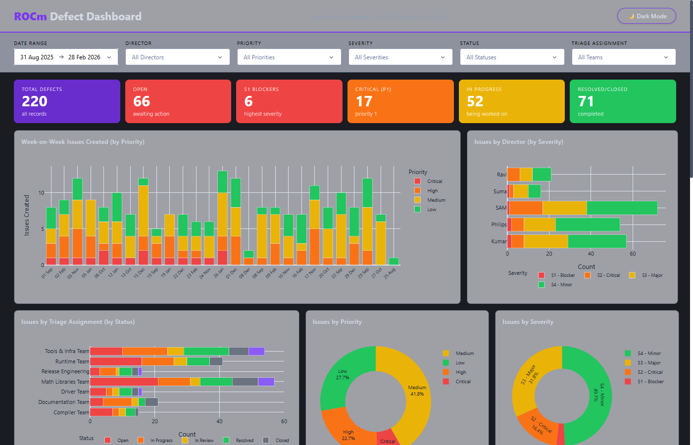
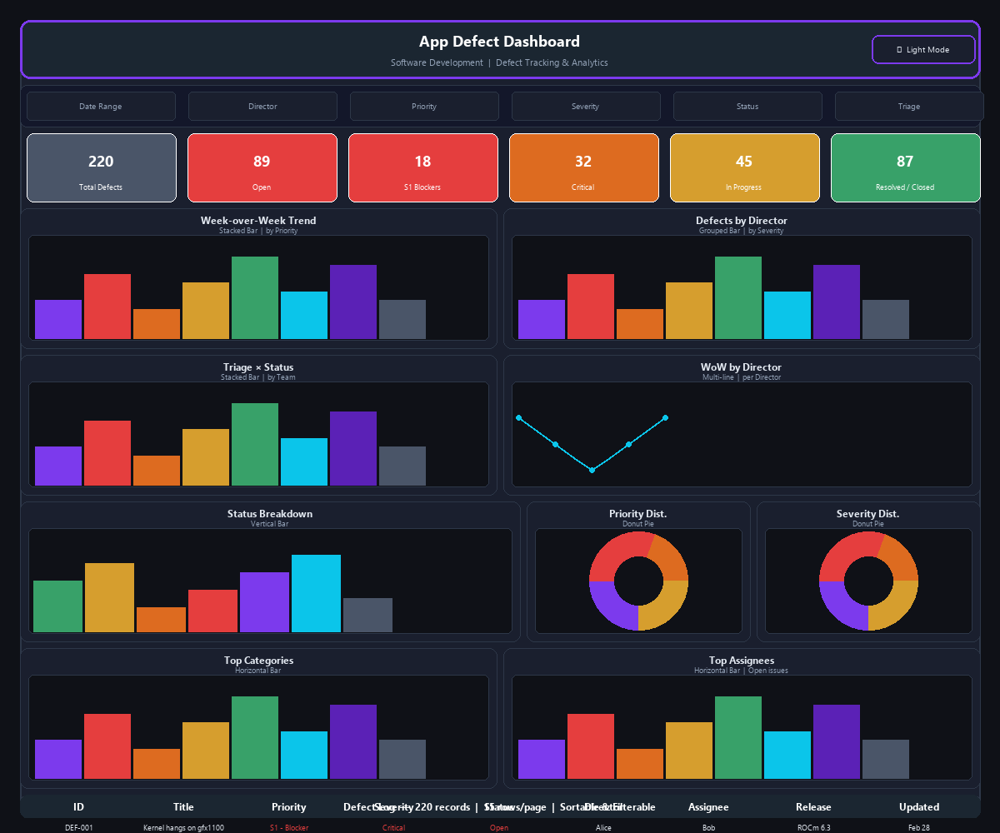
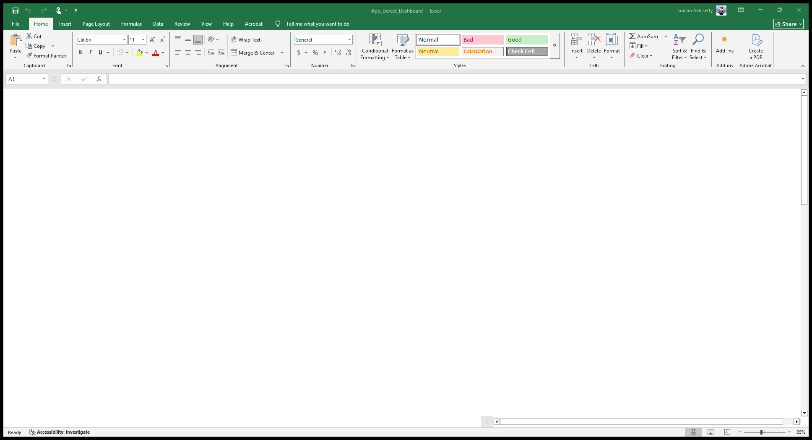
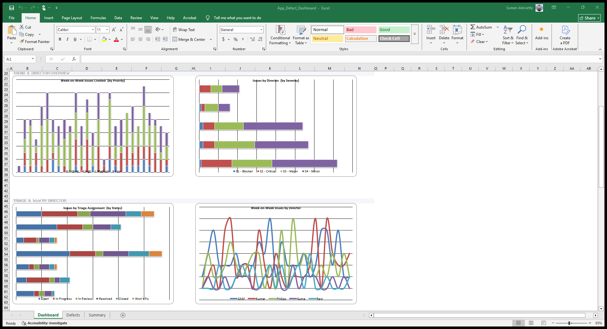
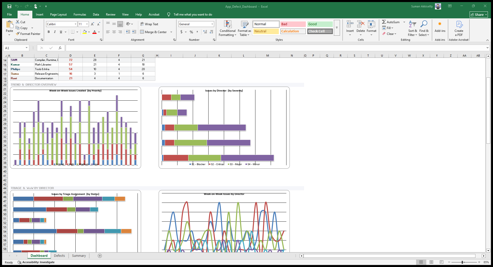
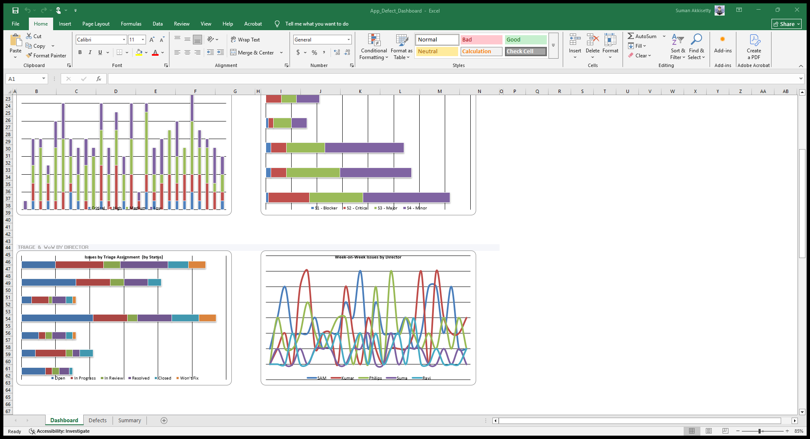
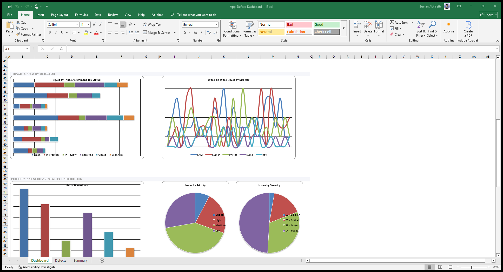
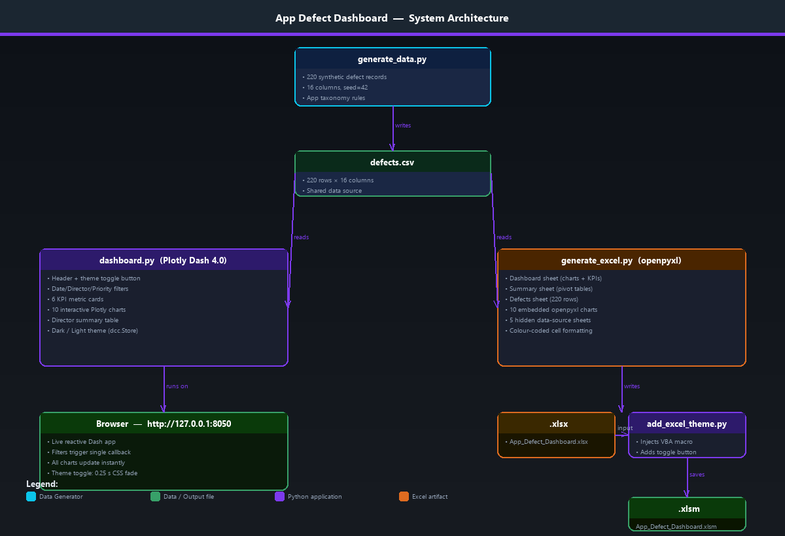

<div align="center">

# App Defect Dashboard

**A full-stack defect tracking and analytics platform**

[](https://www.python.org/)
[](https://dash.plotly.com/)
[](https://openpyxl.readthedocs.io/)
[](LICENSE)

[Features](#-features) · [Screenshots](#-screenshots) · [Quick Start](#-quick-start) · [Architecture](#-architecture) · [Project Structure](#-project-structure) · [Data Model](#-data-model)

</div>

---

## Overview

The **App Defect Dashboard** is an internal analytics tool that tracks, visualizes, and analyzes software defects across your application platform. It ships in two complementary formats:

| Format | Technology | What you get |
|--------|-----------|-------------|
| **Web App** | Plotly Dash 4.0 | Live interactive dashboard at `http://127.0.0.1:8050` |
| **Excel Workbook** | openpyxl + VBA | Shareable `.xlsm` with 10 embedded charts and a dark/light toggle button |

Both outputs are fully self-contained — no database, no external API, no login required.

---

## Features

### Web Dashboard
- **10 interactive Plotly charts** — stacked bars, grouped bars, donuts, multi-line, horizontal bars
- **6 KPI metric cards** — colour-coded for Total, Open, S1 Blockers, Critical, In Progress, Resolved
- **6 filter controls** — Date Range, Director, Priority, Severity, Status, Triage Assignment; all AND-combined
- **Director Summary table** — pivot-style breakdown with per-director open/critical/resolved counts
- **Paginated defect log** — 15 rows/page, sortable, colour-coded priority/severity columns
- **Dark / Light theme toggle** — single click switches every chart, card, table, and container with a 0.25 s CSS fade

### Excel Workbook
- **3 visible sheets** — Dashboard (charts), Defects (raw data), Summary (pivot tables)
- **5 hidden data sheets** — clean separation of chart source data
- **10 embedded openpyxl charts** — arranged in a clean 2-column grid
- **VBA theme toggle** — Dark/Light button on the Dashboard sheet via macro injection

---

## Screenshots

### Web Dashboard — Dark Mode


### Web Dashboard — Light Mode


### UI Layout Wireframe


### Excel Dashboard










---

## Architecture



```
generate_data.py  →  defects.csv  ──┬──  dashboard.py  →  Browser (http://127.0.0.1:8050)
                                    └──  generate_excel.py  →  .xlsx  →  add_excel_theme.py  →  .xlsm
```

| Component | Role |
|-----------|------|
| `generate_data.py` | Generates 220 synthetic defect records (reproducible, seed=42) |
| `defects.csv` | Shared data source consumed by both outputs |
| `dashboard.py` | Plotly Dash 4.0 web app — all charts, filters, KPIs, and theme toggle |
| `generate_excel.py` | openpyxl workbook builder — charts, pivot tables, formatted data |
| `add_excel_theme.py` | Injects VBA macro + toggle button shape into the `.xlsm` |
| `generate_diagrams.py` | Generates the architecture and UI layout PNG diagrams |
| `build_docs.py` | Compiles the Markdown docs into a self-contained HTML file |

---

## Quick Start

### 1. Clone the repo

```bash
git clone https://github.com/sumanakkisetty/Defect_Dashboard.git
cd Defect_Dashboard
```

### 2. Create a virtual environment & install dependencies

```bash
python -m venv .venv
# Windows
.venv\Scripts\activate
# macOS / Linux
source .venv/bin/activate

pip install -r requirements.txt
```

### 3. Run the web dashboard

```bash
python dashboard.py
```

Open **http://127.0.0.1:8050** in your browser.

### 4. Generate the Excel workbook

```bash
# Step 1 — build the .xlsx (charts + data)
python generate_excel.py

# Step 2 — inject VBA theme toggle (Windows + Excel required)
python add_excel_theme.py
```

Open `App_Defect_Dashboard.xlsm` in Excel. Enable macros when prompted, then click the **☀ Light Mode** button on the Dashboard sheet.

### 5. (Optional) Regenerate the dataset

```bash
python generate_data.py       # overwrites defects.csv
```

### 6. (Optional) Rebuild the HTML documentation

```bash
python build_docs.py          # outputs App_Defect_Dashboard_Documentation.html
```

---

## Project Structure

```
Defect_Dashboard/
│
├── dashboard.py                          # Plotly Dash web app
├── generate_excel.py                     # Excel workbook generator
├── add_excel_theme.py                    # VBA macro injector (Windows/Excel)
├── generate_data.py                      # Synthetic dataset generator
├── generate_diagrams.py                  # Diagram PNG generator (Pillow)
├── build_docs.py                         # HTML documentation builder
│
├── defects.csv                           # Dataset — 220 rows × 16 columns
├── App_Defect_Dashboard.xlsx            # Generated Excel workbook
├── App_Defect_Dashboard_Documentation.md    # Source documentation
├── App_Defect_Dashboard_Documentation.html  # Compiled HTML docs (self-contained)
├── requirements.txt
│
├── screenshots/                          # Dashboard & Excel captures
│   ├── screenshot_dark.png
│   ├── screenshot_light.png
│   ├── xl_dash_top.png
│   ├── xl_dash_ch1.png  …  xl_dash_ch4.png
│   ├── xl_defects.png
│   └── xl_summary.png
│
└── diagrams/                             # Generated diagram images
    ├── architecture.png
    └── ui_layout.png
```

---

## Data Model

Each defect record in `defects.csv` contains 16 fields:

| Field | Type | Description |
|-------|------|-------------|
| `Defect_ID` | string | Unique identifier (e.g. `DEF-001`) |
| `Title` | string | Short description of the defect |
| `Created_Date` | date | Date the defect was filed |
| `Created_By` | string | Reporter name |
| `Priority` | enum | `Critical · High · Medium · Low` |
| `Severity` | enum | `S1 - Blocker · S2 - Critical · S3 - Major · S4 - Minor` |
| `Status` | enum | `Open · In Progress · In Review · Resolved · Closed · Won't Fix` |
| `Triage_Category` | string | App component area (e.g. `Compiler`, `Runtime`, `HIP`) |
| `Triage_Assignment` | string | Team responsible for triage |
| `Director` | string | Engineering director (SAM · Kumar · Philips · Suma · Ravi) |
| `Assignee` | string | Engineer assigned to fix |
| `Component` | string | App sub-component |
| `Target_Release` | string | Planned fix release (e.g. `v6.3`) |
| `Found_In_Release` | string | Release where the defect was found |
| `Last_Updated_Date` | date | Most recent update timestamp |
| `Resolution` | string | Resolution notes (populated when Resolved/Closed) |

---

## Dashboard Charts Reference

| Chart | Type | Dimensions |
|-------|------|------------|
| Week-on-Week Issues Created | Stacked Bar | Week × Priority |
| Issues by Director | Grouped Bar | Director × Severity |
| Issues by Triage Assignment | Stacked Bar | Team × Status |
| Issues by Priority | Donut Pie | Priority |
| Issues by Severity | Donut Pie | Severity |
| Issues by Triage Category | Horizontal Bar | Category |
| Status Breakdown | Vertical Bar | Status |
| Top Assignees (open issues) | Horizontal Bar | Assignee |
| Week-on-Week by Director | Multi-line | Week × Director |
| Target Release Distribution | Vertical Bar | Release |

---

## Theme Palette

| Token | Dark Mode | Light Mode |
|-------|-----------|------------|
| Page background | `#0f1117` | `#F0F4F8` |
| Card background | `#1a1f2e` | `#FFFFFF` |
| Border | `#2d3748` | `#CBD5E0` |
| Primary text | `#e2e8f0` | `#1A202C` |
| Accent (purple) | `#7c3aed` | `#5B21B6` |

Theme state is managed via `dcc.Store(id="theme")` — a single Dash callback rebuilds all 13 outputs (10 charts + KPIs + table + styles) on every theme change or filter interaction.

---

## Requirements

```
dash >= 2.14.0
pandas >= 2.0.0
plotly >= 5.18.0
numpy >= 1.24.0
openpyxl >= 3.1.0
```

> **Excel theme toggle** additionally requires `pywin32` and Microsoft Excel (Windows only).
> The web dashboard and Excel generation work on any OS.

---

## Documentation

Full documentation is available as a self-contained HTML file:

```bash
open App_Defect_Dashboard_Documentation.html   # macOS
start App_Defect_Dashboard_Documentation.html  # Windows
```

All screenshots and diagrams are base64-embedded — no internet connection required.

---

<div align="center">

Built with Plotly Dash · openpyxl · pandas · Pillow

</div>
